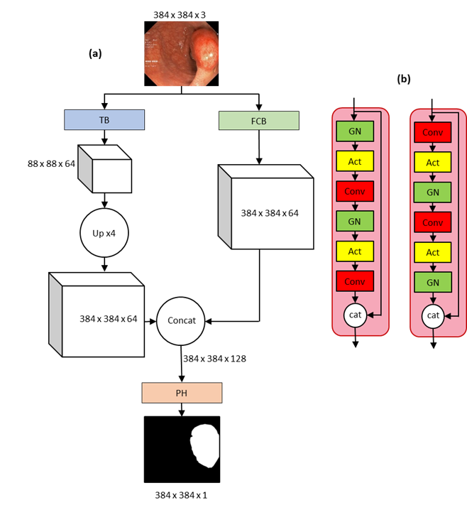

[](https://paperswithcode.com/sota/medical-image-segmentation-on-kvasir-seg?p=fcb-swinv2-transformer-for-polyp-segmentation)
	
[](https://paperswithcode.com/sota/medical-image-segmentation-on-cvc-clinicdb?p=fcb-swinv2-transformer-for-polyp-segmentation)

# FCB-SwinV2 Transformer for Polyp Segmentation

Official code repository for: FCB-SwinV2 Transformer for Polyp Segmentation (INSERT PUBLICATION NAME)

Authors: [Kerr Fitzgerald](https://scholar.google.co.uk/citations?user=sapCpr4AAAAJ&hl=en&oi=ao) and [Bogdan J. Matuszewski](https://scholar.google.co.uk/citations?user=QlUO_oAAAAAJ&hl=en)

Links to the paper:
+ [arXiv](https://arxiv.org/abs/2302.01027)

## 1. Overview

### 1.1 Abstract

Polyp segmentation within colonoscopy video frames using deep learning models has the potential to automate the workflow of clinicians. This could help improve the early detection rate and characterization of polyps which could progress to colorectal cancer. Recent state-of-the-art deep learning polyp segmentation models have combined the outputs of Fully Convolutional Network architectures and Transformer Network architectures which work in parallel. We propose modifications to the current state-of-the-art polyp segmentation model FCBFormer. The transformer architecture of the FCBFormer is replaced with a SwinV2 Transformer-UNET and minor changes to the Fully Convolutional Network architecture are made to create the FCB-SwinV2 Transformer. The performance of the FCB-SwinV2 Transformer is evaluated on the popular colonoscopy segmentation benchmarking datasets Kvasir-SEG and CVC-ClinicDB. Generalizability tests are also conducted. 

### 1.2 Architecture

</p>
<p align="center">
	 <br />
	<em>
		Figure 1:(a) Overall FCB-SwinV2 Transformer architecture consisting of a Transfromer Branch (TB) and Fully Convolutional Branch (FCB) which work in parallel. (b) Original Residual Block used by the FCBFormer (left) vs the Residual Blocks used by the FCB-SwinV2 Transformer (right) which features residual post normalization.
	</em>
</p>

</p>
<p align="center">
	 <br />
	<em>
		Figure 2: SwinV2-UNET architecture used as the TB of the FCB-SwinV2 Transformer. The encoder stages reduce the spatial dimensions of feature maps while increasing the number of channel dimensions. Skip connections are used to pass feature maps generated by each stage of the encoder to decoder stages. The encoder is pre-trained using ImageNet22K.
	</em>
</p>

</p>
<p align="center">
	 <br />
	<em>
		Figure 3: (a) The decoder block uses channel wise concatenation to combine previous decoder layer output with encoder skip connection output. It is necessary after the first decoder layer to use interpolation to scale the spatial dimensions of  previous decoder layer output to match the spatial dimensions of the encoder skip connection output. (b) The structure of the SCSE module which combines the output of the CSE and SSE modules.
	</em>
</p>


## 2. Usage

### 2.1 Preparation

+ Results produced in this work were generated using an Nvidia RTX 3090 GPU on a Linux operating system (Ubuntu).

+ Requirements (code libraries, versions, etc.) can be found in the requirements.txt file. Ensure these are installed.

+ Clone the repository and navigate to new directory:

```
git clone https://github.com/KerrFitzgerald/FCBSwinV2_Transformer
cd ./FCBSwinV2_Transformer
```

+ Download and extract the [Kvasir-SEG](https://datasets.simula.no/downloads/kvasir-seg.zip) and the [CVC-ClinicDB](https://www.dropbox.com/s/p5qe9eotetjnbmq/CVC-ClinicDB.rar?dl=0) datasets.

+ Download the [SwinV2](https://github.com/SwinTransformer/storage/releases/download/v2.0.0/swinv2_large_patch4_window12to24_192to384_22kto1k_ft.pth) ImageNet pre-trained weights.

+ Create folders named "Kvasir_Results/" and "CVC-ClinicDB_Results/" to store model weights and performance metrics for training, validation and testing (.csv files).

### 2.2 Training and Evaluation

+ To train and evaluate the model on the Kvasir-SEG data (for the fixed data partition specified in the paper) run all cells within the [Kvasir-SEG FDP Notebook](https://github.com/KerrFitzgerald/FCBSwinV2_Transformer/blob/main/Kvasir_FCBSwinV2_Transformer_FDP.ipynb)

+ To train and evaluate the model on the CVC-ClinicDB data (for the random data partition used in the paper) run all cells within the [CVC-Clinic RP Notebook](https://github.com/KerrFitzgerald/FCBSwinV2_Transformer/blob/main/CVCClinicDB_FCBSwinV2_Transformer_RDP.ipynb)

+ Generalizability tests can be conducted by running the [Trained on Kvasir-SEG FDP and Evaluated on CVC-ClinicDB](https://github.com/KerrFitzgerald/FCBSwinV2_Transformer/blob/main/Kvasir_FDP_Train_CVCClinicDB_Test_EVALUATION.ipynb) and [Trained on CVC-ClinicDB RDP and Evaluated on Kvasir-SEG](https://github.com/KerrFitzgerald/FCBSwinV2_Transformer/blob/main/CVCClinicDB_RDP_Train_Kvasir_Test_EVALUATION.ipynb) notebooks.

### 2.3 Examples of Produced Segmentation Maps

</p>

<p align="center">
	 <br />
	<em>
		Figure 2: Visual comparisons of predictions made by the FCB-SwinV2 Transformer for the Kvasir-SEG dataset when trained using the fixed data partition and when trained using the CVC-ClinicDB dataset. The generalizability of the model  is good  for regular polyps but suffers a large performance drop for certain large, irregular polyps.
	</em>
</p>

<p align="center">
	 <br />
	<em>
		Figure 3: Visual comparisons of predictions made by the FCB-SwinV2 Transformer for the CVC-ClinicDB dataset when trained using the random data partition, when trained using the data partition which ensured no data leakage and when trained using the Kvasir-SEG dataset. When using a random data partition, the model has been trained and evaluat-ed on images of the same polyp from a video sequence resulting in artificially high performance. 
	</em>
</p>


## 3. License

This repository is released under the XXX license as found in the [LICENSE](https://github.com/KerrFitzgerald/FCBSwinV2_Transformer/blob/main/LICENSE) file.

## 4. Citation

If you use this work, please consider citing us:

```bibtex
@inproceedings{,
  title={},
  author={Fitzgerald, Kerr and Matuszewski, Bogdan J},
  journal={},
  pages={},
  year={},
  organization={}
}
```

## 5. Acknowledgements

This work makes use of data from the Kvasir-SEG dataset, available at https://datasets.simula.no/kvasir-seg/.

This work makes use of data from the CVC-ClinicDB dataset, available at https://polyp.grand-challenge.org/CVCClinicDB/.

Results are obtained using ImageNet pre-trained weights for the SwinV2 Encoder system, available at [SwinV2 Encoder Weights](https://github.com/SwinTransformer/storage/releases/download/v2.0.0/swinv2_large_patch4_window12to24_192to384_22kto1k_ft.pth)

This repository includes code from the following sources:

[FCB-Former](https://github.com/ESandML/FCBFormer)

[SwinV2 Encoder](https://github.com/rwightman/pytorch-image-models/blob/main/timm/models/swin_transformer_v2.py)

[SwinV2-UNET](https://www.kaggle.com/code/abebe9849/swin-v2-unet-upernet)

[SCSE Module](https://github.com/qubvel/segmentation_models.pytorch/blob/master/segmentation_models_pytorch/base/modules.py)

## 7. Additional information

Links: [CVML Group](https://www.uclan.ac.uk/research/activity/cvml)

Contact: kffitzgerald@uclan.ac.uk
